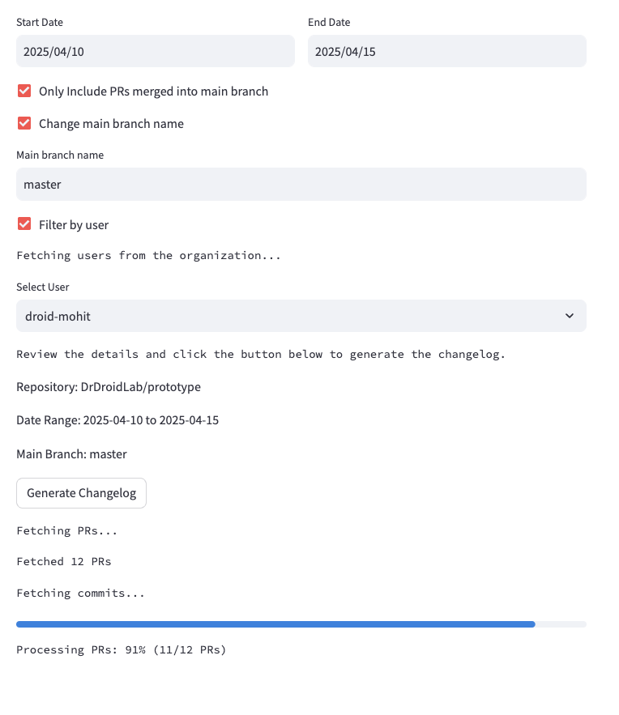

# changelog-generator

This document helps you auto-generate changelog for your Github Repository.

* If you want to run it,
    * Fork the project
    * Create a .streamlit folder with secrets.toml file in it.
    * Add github_api_key and OPENAI_API_KEY in it. For the github_api_key, if you add permission of members read (organisation), then you will also be able to filter it by author.
    * Test it locally by running the command "streamlit run streamlit_app.py"
    * To deploy it in cloud, you can sign up on Streamlit's free Cloud hosting service at https://share.streamlit.io/

* If you have any feedback or requests, please raise them - [here](https://github.com/DrDroidLab/changelog-generator/issues).

### Contributions welcome.
